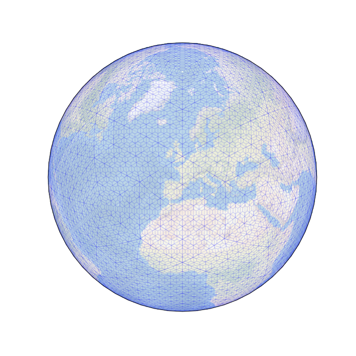
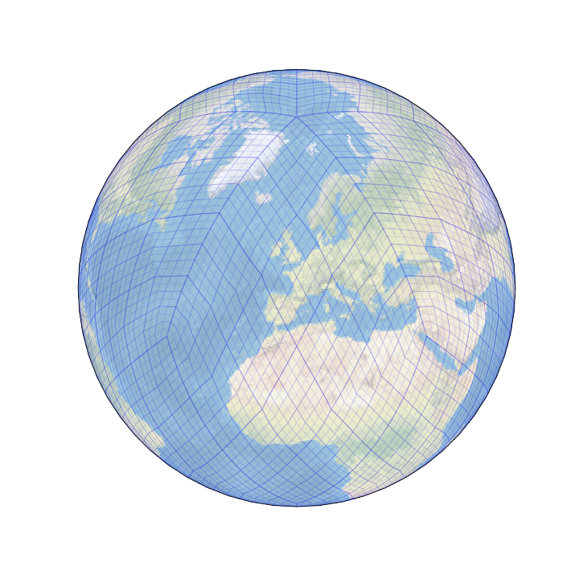
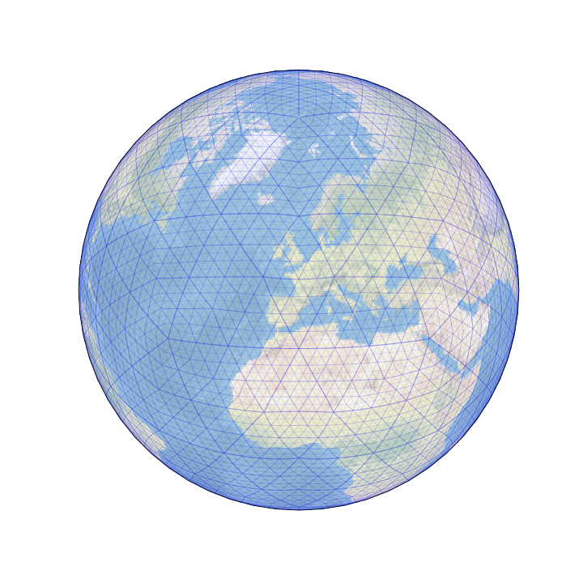
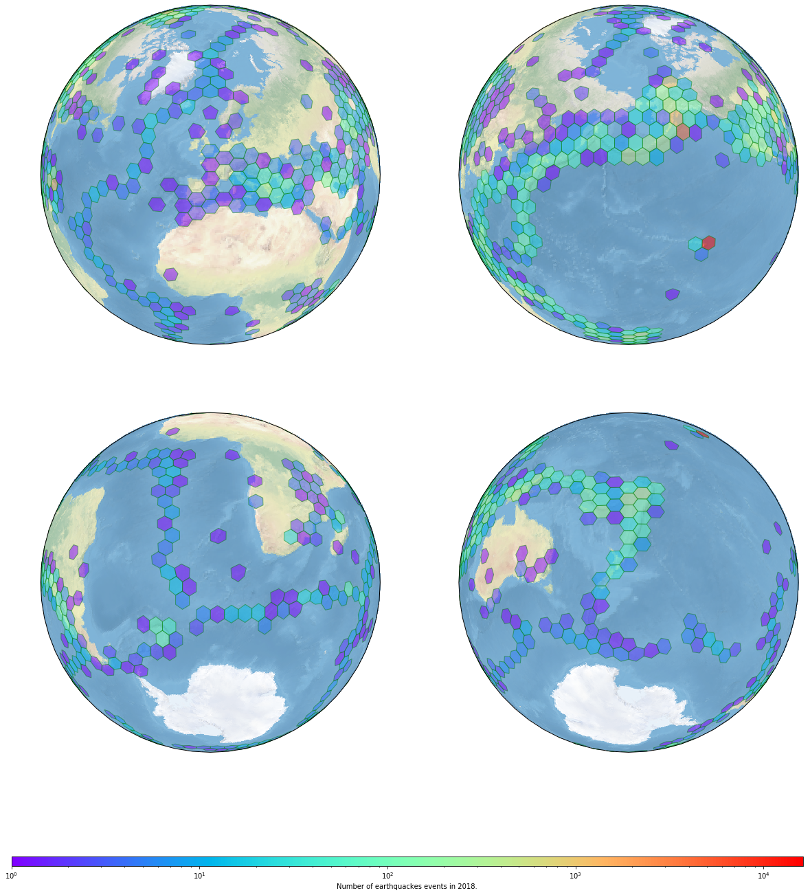

# dggridpy: Discrete Global Grids for Python

 

 

Discrete Global Grid Systems ([DGGS](http://www.opengeospatial.org/projects/groups/dggsswg) for short) allow to subdivide the Earth's sphere in equal size regions that can be used to index or bin geospatial data into homogeneous bins.

`dggridpy` offers a python binding to some of the API implemented in the [DGGRID library][dggrid] and the [dggridR package][dggridr] to transform latitude/longitude coordinates in DGGS cells, and back from DGGS cells into the tiles' shapes to visualise results in a map.

[dggrid]: http://www.discreteglobalgrids.org/software/
[dggridr]: https://github.com/r-barnes/dggridR

## Install
To install the package follow the instructions in [INSTALL.md](INSTALL.md).

## API
The initial set of APIs wrapped in Python are described in [API.md](API.md).

## Credits

The code in the [src](src) directory is the DGGRIDv6.2b developed by [Southern Terra Cognita Laboratory](https://discreteglobalgrids.org/) and includes also modifications from [Richard Barnes](https://github.com/r-barnes/dggridR) for easing the wrapping in R.

## Licensing

This package includes several libraries adopting the following licenses:

 - clipper: released under the [Boostv1](https://tldrlegal.com/license/boost-software-license-1.0-explained) license

 - dggrid: released DGGRID with a [GNU Affero General Public License](https://tldrlegal.com/license/gnu-affero-general-public-license-v3-(agpl-3.0))

 - proj4lib: Gerald Evenden has released this code into the public domain. More recent versions of the library, not used here, are under an [MIT license](https://tldrlegal.com/license/mit-license).

 - shapelib: released under the [MIT license](https://tldrlegal.com/license/mit-license).

**This package, and all code and documentation not otherwise mentioned above** are released under the [MIT license](https://tldrlegal.com/license/mit-license), as stated in the LICENSE file.
